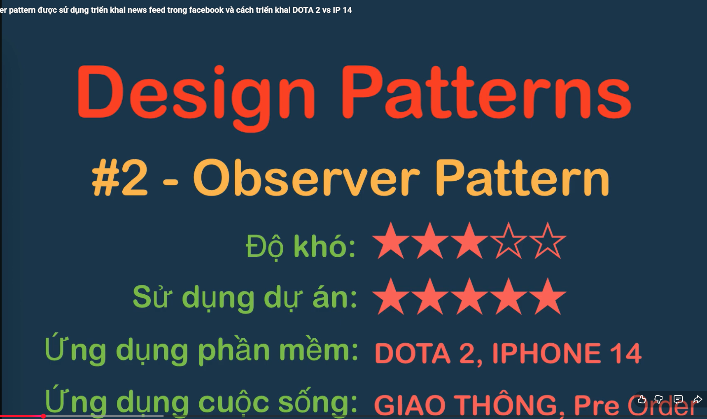

Observer Pattern (Mẫu quan sát) là một mẫu thiết kế thuộc nhóm Behavioral Pattern (Mẫu hành vi).

Hiểu một cách đơn giản: Observer Pattern thiết lập một cơ chế "đăng ký - lắng nghe" (publish-subscribe). Khi một đối tượng thay đổi trạng thái, tất cả các đối tượng khác đang "theo dõi" nó sẽ tự động được thông báo và cập nhật.

Bạn có thể liên tưởng nó giống như việc bạn nhấn nút "Subscribe" một kênh YouTube. Khi kênh đó (đối tượng bị quan sát) ra video mới, một thông báo sẽ tự động được gửi đến tất cả những người đã đăng ký (người quan sát) mà kênh không cần biết cụ thể từng người là ai.

🛠️ Cấu trúc cốt lõi của Observer Pattern
Mẫu này xoay quanh 2 thành phần chính:

Subject (Publisher - Người phát hành / Đối tượng bị quan sát):

Quản lý một danh sách các Observer (thêm vào hoặc xóa đi).

Khi có sự kiện hoặc dữ liệu thay đổi, nó sẽ lặp qua danh sách này và gọi hàm cập nhật của từng Observer.

Observer (Subscriber - Người đăng ký / Người quan sát):

Là một Interface (giao diện) định nghĩa phương thức nhận thông báo (thường là hàm update()).

Concrete Observer: Là các đối tượng thực tế triển khai giao diện Observer để thực hiện một hành động cụ thể khi nhận được thông báo từ Subject.

⚖️ Ưu điểm và Nhược điểm
Ưu điểm 👍
Loose Coupling (Khớp nối lỏng lẻo): Subject không cần biết Observer là class nào, hoạt động ra sao. Nó chỉ cần biết Observer có hàm update(). Điều này giúp code dễ bảo trì và mở rộng.

Tuân thủ Open/Closed Principle: Bạn có thể thêm bao nhiêu Observer mới tùy thích (ví dụ: gửi thông báo qua Email, SMS, App Push) mà không cần sửa đổi code của class Subject.

Quan hệ động (Dynamic Relationships): Có thể thiết lập hoặc hủy bỏ các mối quan hệ theo dõi ngay trong lúc phần mềm đang chạy (runtime).

Nhược điểm 👎
Thứ tự thông báo ngẫu nhiên: Thông thường, thứ tự các Observer nhận được thông báo là không cố định hoặc phụ thuộc vào danh sách mảng. Không nên viết code mà Observer này phụ thuộc vào Observer khác chạy trước.

Rò rỉ bộ nhớ (Memory Leaks): Đây là lỗi rất phổ biến gọi là Lapsed Listener Problem. Nếu một Observer được tạo ra, đăng ký vào Subject, nhưng khi không dùng nữa lại quên gọi hàm unsubscribe(), Subject vẫn giữ tham chiếu đến nó khiến bộ thu gom rác (Garbage Collector) không thể giải phóng bộ nhớ.